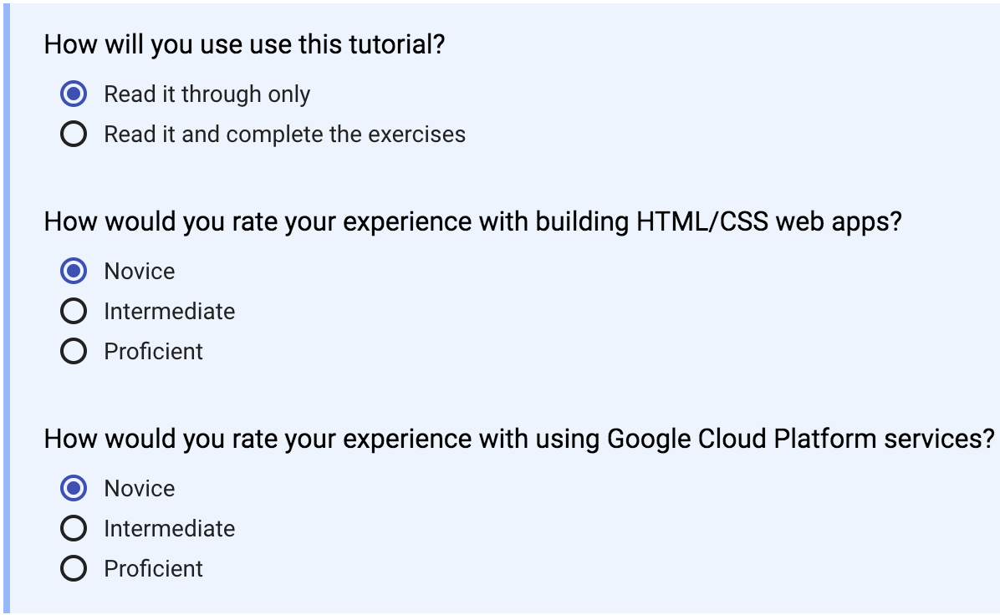
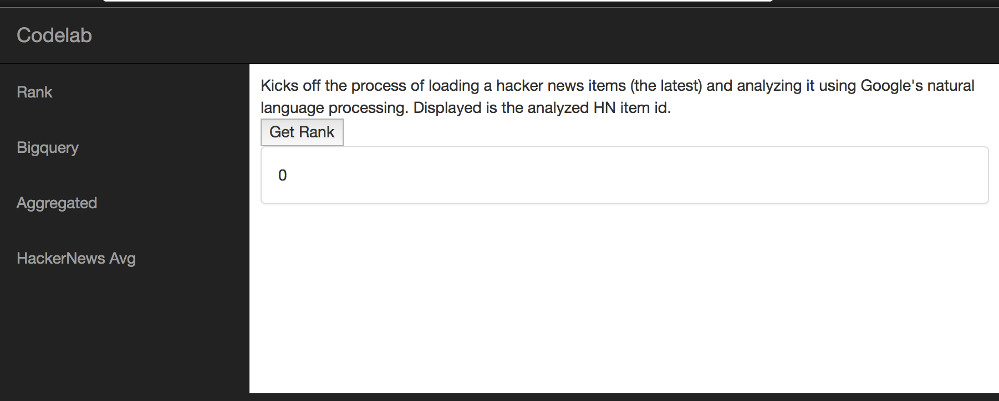

Google Code Lab
===============

## About

In this codelab, we will be building an application that combines several GCP
services to build a fully functioning application. The application we will
build utilizes [Google App Engine][GAE] for our user traffic and backend
processing tasks, [Google Cloud SQL][CSQL] for storage, and [Google Cloud
NL][CNL] for sentiment analysis.

This codelab builds upon some of [Google's Codelabs][GCL]:

- [Getting Started with App Engine (Python)][GCL.GAE]
- [Entity and Sentiment Analysis with the Natural Language API][GCL.NL]
- [Create a Managed MySQL database with Cloud SQL][GCL.SQL]


## How to Use this Codelab

This codelab may be followed along by cloning this repository, then following
this README. Once you are on [STEP
3](#step-3-putting-the-pieces-together), if you are struggling with a sub-step,
Step-3.A for example, checkout the branch named STEP-3A. It will contain the
completed code.

This codelab should be completed using the Google Cloud Shell. This is what all
of the Google provided codelabs recommend using as well. Cloud Shell is
accessed from the Google Cloud Console, by clicking the button to the right of
the search box:


I recommend working through all exercises in the Google Codelabs, and I suggest
selecting Novice. Your settings for each codelab should look something like
this:



You may use an existing Cloud Project or create a new Cloud Project for use
during this codelab. Please note, if you use Qwiklabs your project will be
reset after each codelab - for this reason I recommend using your own Cloud
Project.

*NOTE:* This codelab might cost between $1 and $3 in compute resources.


## STEP 0: Getting Started with Google App Engine

We will use [Google App Engine][GAE] to serve user requests, perform backend
processing, and to host our static resources.

Work through Google's [Getting Started with App Engine (Python)][GCL.GAE]
codelab, then move on to [STEP 1](#step-1-getting-started-with-google-cloud-natural-language-api).


## STEP 1: Getting Started with Google Cloud Natural Language API

We will use [Google Cloud Natural Language API][CNL] to conduct sentiment
analysis on entities we fetch from [Hacker News][HN]. In this step, we will
introduce you to the basics of the APIs.

Work through Google's [Entity and Sentiment Analysis with the Natural Language
API][GCL.NL] codelab, then move on to [STEP 2](#step-2-getting-started-with-google-cloud-sql-mysql).

*NOTE:* Do not forget to enable the Cloud Natural Language API. To do this, under
API Manager, goto Library, then find Cloud Natural Language and click it. Click
enable.


## STEP 2: Getting Started with Google Cloud SQL MySQL

We will use [Google Cloud SQL][CSQL] to store the results of our sentiment
analysis.

Work through Google's [Create a Managed MySQL database with Cloud SQL][GCL.SQL]
codelab, then move on to [STEP 3](#step-3-putting-the-pieces-together).

*NOTE:* Select Second Generation when creating your instance.

*NOTE:* When creating your instance, be sure to set a root password.

*NOTE:* Do NOT delete your instance yet, we will use it in [STEP
3](#step-3-putting-the-pieces-together).


## STEP 3: Putting the Pieces Together

In this step, we will build on the prior steps and integrate App Engine, SQL,
and Natural Language API.

All steps are meant to be run within the Cloud Shell you used in the prior
steps.

### A. Clone the Codelab Repo

Clone the codelab repo - where you are reading this.

```sh
$ mkdir code && cd code
$ git clone https://github.com/RealKinetic/codelab.git
$ cd codelab
```

### B. Review app.yaml, and handler setup

This app uses [Flask](http://flask.pocoo.org/), a simple Python framework.

Open app.yaml, note that we map a static route to `/` and that we use a
"catch-all" route (`.*`) to handle all other requests.

Our catch-all is mapped to `app` which is exposed from
`src/handler/__init__.py`. Here, we map all of our endpoints to request
handlers. Take a moment and review these handlers.

### C. Deploy Your Application

Deploy your application to App Engine:

```sh
gcloud app deploy app.yaml
```

Then verify that you can access it by viewing `http://<project-id>.appspot.com`
in your browser. You should see the following:




### Setup the DB.

If you followed the [Google Cloud SQL][GCL.SQL] codelab, you can skip this
step.

You will need to create a MySQL Database named `codelab`.

```sh
$ mysql -u root -p
```
```SQL
> CREATE DATABASE codelab;
```


[GAE]: https://cloud.google.com/appengine/
[CSQL]: https://cloud.google.com/sql/docs/mysql/
[CNL]: https://cloud.google.com/natural-language/
[GCL]: https://codelabs.developers.google.com/cloud?cat=Cloud
[GCL.GAE]: https://codelabs.developers.google.com/codelabs/cloud-app-engine-python/index.html
[GCL.NL]: https://codelabs.developers.google.com/codelabs/cloud-nl-intro/index.html
[GCL.SQL]: https://codelabs.developers.google.com/codelabs/cloud-create-cloud-sql-db/index.html
[HN]: https://news.ycombinator.com/

