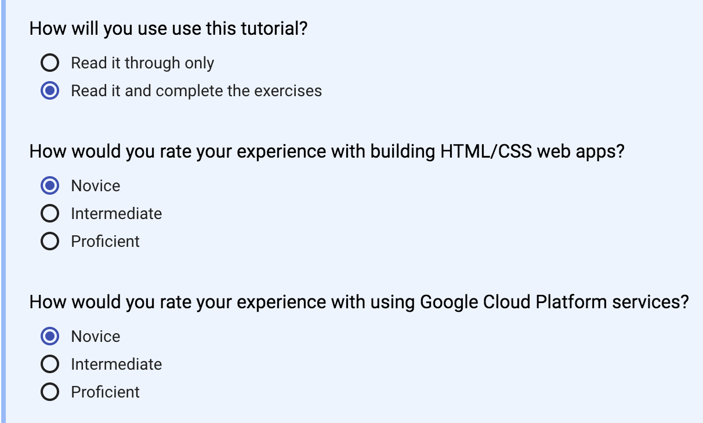

Google Code Lab
===============

## About

In this codelab, we will be building an application that combines several GCP
services to build a fully functioning application. The application we will
build utilizes Google App Engine for our user traffic and backend processing
tasks, Google Cloud SQL for storage, and Google Cloud NL for sentiment
analysis.

This codelab builds upon some of [Google's
Codelabs](https://codelabs.developers.google.com/cloud?cat=Cloud):

- [Getting Started with App Engine
  (Python)](https://codelabs.developers.google.com/codelabs/cloud-app-engine-python/index.html)
- [Entity and Sentiment Analysis with the Natural Language
  API](https://codelabs.developers.google.com/codelabs/cloud-nl-intro/index.html)
- [Create a Managed MySQL database with Cloud
  SQL](https://codelabs.developers.google.com/codelabs/cloud-create-cloud-sql-db/index.html)

## How to Use this Codelab

This codelab may be followed along by cloning this repository, then following
this README. If you are struggling with a step, step-2 for example, you may
checkout the branch named STEP-2.

This codelab should be completed using the Google Cloud Shell. This is what all
of the Google provided codelabs recommend using as well. Cloud Shell is
accessed from the Google Cloud Console, by clicking the button to the right of
the search box:

I recommend working through all Google Codelabs with the following settings:

You may use an existing Cloud Project or create a new Cloud Project for use
during this codelab. Please note, if you use Qwiklabs your project will be
reset after each codelab - for this reason I recommend using your own Cloud
Project.

NOTE: This codelab might cost between $1 and $3 in compute resources.

## Getting Started

